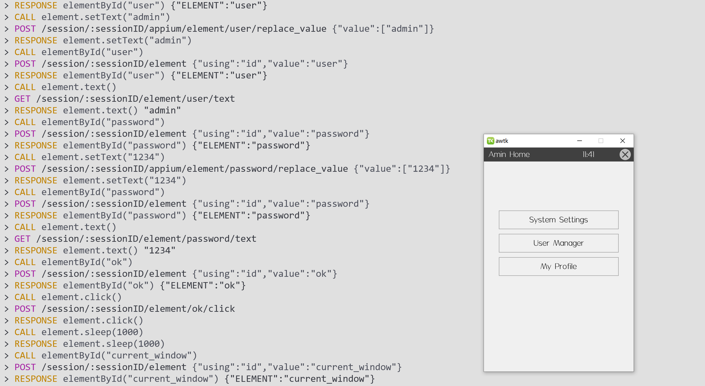
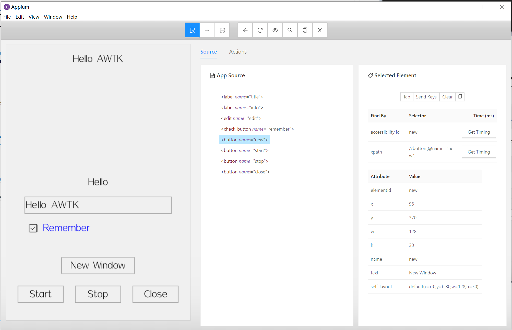

# awtk-ui-automation

AWTK 自动化测试引擎，兼容 appium 接口，轻松实现 UI 全自动化测试。






## 准备

1. 获取 awtk 并编译

```
git clone https://github.com/zlgopen/awtk.git
cd awtk; scons; cd -
```

2. 获取 awtk-restful-httpd 并编译
```
git clone https://github.com/zlgopen/awtk-restful-httpd.git
cd awtk-restful-httpd; scons; cd -
```

3. 获取 awtk-ui-automation 并编译
```
git clone https://github.com/zlgopen/awtk-ui-automation.git
cd awtk-ui-automation; scons
```

## 运行

> 考虑到 github 的下载速度，生成的临时资源没放到 git 中，需要自己生成资源：

```
./scripts/update_res.py all
```

* 1. 启动Appium-desktop

* 2. 运行测试

```
cd uitests
npm run test
```

## 文档

* 0.[测试脚本常用 API ](docs/api.md)

* 1.[安装支持 AWTK 自动测试的 Appium Desktop](docs/how_to_install_appium_for_awtk.md)

* 2.[集成 AWTK 自动测试引擎](docs/how_to_integrate_awtktk_ui_automation.md)

* 3.[如何用 JS 编写测试脚本](docs/how_to_write_javascript_test.md)

* 4.[让 Appium 支持 AWTK 的笔记](docs/modify_appium_for_awtk.md)

* 5.[Appium + AWTK 工作原理](docs/how_appium_awtk_works.md)

* 6.[完整示例](https://github.com/zlgopen/awtk-mvvm-c-hello)
