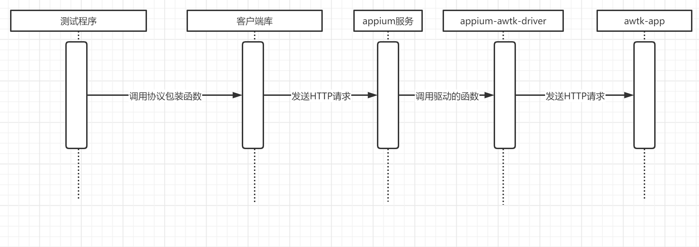

# Appium + AWTK 的工作原理

## 1. 介绍

Appium 的工作原理其实也很简单，但是之前完全没有了解它，为了让 AWTK 支持 Appium 还是花了我不少时间去研究，这里做个笔记：

工作流程大致如下：



* appium 是一个 restful API 的 HTTP 服务器。虽然它是整个系统的中心，但是它并不复杂，代码也不多，主要功能是根据客户端提供的参数（如 platformName)，选择合适的 driver，然后就让 driver 做相应的事情了。

* appium-awtk-driver 也简单，它只是把请求通过 HTTP REST API 发送给 awtk-app。

* 客户端是对 Appium 服务器提供的 REST API 的包装。

* awtk-app 根据 [webdriver](https://www.w3.org/TR/webdriver) 协议提供了一套 REST API。

## 2. awtk 测试引擎

awtk 测试引擎相对来说复杂一点，它根据 [webdriver](https://www.w3.org/TR/webdriver) 协议提供了一套 REST API，目前支持下面这些 API（以后可能根据实际情况扩展）:

```c
static ret_t automation_agent_on_new_session(http_connection_t* c) {
  conf_doc_t* resp = c->resp;

  conf_doc_set_int(resp, STR_STATUS, 0);
  conf_doc_set_str(resp, "value.sessionId", "8888");
  conf_doc_set_str(resp, "value.capabilities.platformName", "awtk");

  return RET_OK;
}
...
/*https://www.w3.org/TR/webdriver*/
static const http_route_entry_t s_automation_agent_routes[] = {
    {HTTP_POST, "/wd/hub/session", automation_agent_on_new_session},
    {HTTP_DELETE, "/wd/hub/session/:session", automation_agent_on_remove_session},
    {HTTP_GET, "/wd/hub/session/:session", automation_agent_on_get_session},
    {HTTP_POST, "/wd/hub/session/:session/url", automation_agent_on_set_url},
    {HTTP_GET, "/wd/hub/status", automation_agent_on_status},
    {HTTP_GET, "/wd/hub/session/:session/source", automation_agent_on_get_source},
    {HTTP_GET, "/wd/hub/session/:session/contexts", automation_agent_on_get_contexts},
    {HTTP_GET, "/wd/hub/session/:session/context", automation_agent_on_get_context},
    {HTTP_POST, "/wd/hub/session/:session/context", automation_agent_on_set_context},
    {HTTP_GET, "/wd/hub/session/:session/screenshot", automation_agent_on_get_screenshot},
    {HTTP_GET, "/wd/hub/session/:session/timeouts", automation_agent_on_get_timeouts},
    {HTTP_POST, "/wd/hub/session/:session/timeouts", automation_agent_on_set_timeouts},
    {HTTP_POST, "/wd/hub/session/:session/back", automation_agent_on_back},
    {HTTP_GET, "/wd/hub/session/:session/title", automation_agent_on_get_title},

    {HTTP_GET, "/wd/hub/session/:session/window", automation_agent_on_get_window_name},
    {HTTP_GET, "/wd/hub/session/:session/window_handle", automation_agent_on_get_window_name},
    {HTTP_DELETE, "/wd/hub/session/:session/window", automation_agent_on_close_window},
    {HTTP_POST, "/wd/hub/session/:session/window", automation_agent_on_switch_to_window},
    {HTTP_GET, "/wd/hub/session/:session/window_handles", automation_agent_on_get_windows_name},
    {HTTP_GET, "/wd/hub/session/:session/window/:window/rect", automation_agent_on_get_window_rect},
    {HTTP_GET, "/wd/hub/session/:session/window/:window/position",
     automation_agent_on_get_window_position},
    {HTTP_GET, "/wd/hub/session/:session/window/:window/size", automation_agent_on_get_window_size},

    {HTTP_POST, "/wd/hub/session/:session/window/:window/position",
     automation_agent_on_set_window_position},
    {HTTP_POST, "/wd/hub/session/:session/window/:window/size",
     automation_agent_on_set_window_size},
    {HTTP_POST, "/wd/hub/session/:session/window/:window/maximize",
     automation_agent_on_maximize_window},

    {HTTP_POST, "/wd/hub/session/:session/window/new", automation_agent_on_not_impl},
    {HTTP_POST, "/wd/hub/session/:session/window/frame", automation_agent_on_not_impl},
    {HTTP_POST, "/wd/hub/session/:session/window/frame/parent", automation_agent_on_not_impl},
    {HTTP_POST, "/wd/hub/session/:session/touch/perform", automation_agent_on_touch_perform},

    {HTTP_POST, "/wd/hub/session/:session/element", automation_agent_on_get_element},
    {HTTP_POST, "/wd/hub/session/:session/elements", automation_agent_on_get_elements},
    {HTTP_GET, "/wd/hub/session/:session/element/active", automation_agent_on_get_focus_element},
    {HTTP_POST, "/wd/hub/session/:session/element/active", automation_agent_on_get_focus_element},

    {HTTP_GET, "/wd/hub/session/:session/element/:element/text",
     automation_agent_on_get_element_text},
    {HTTP_GET, "/wd/hub/session/:session/element/:element/name",
     automation_agent_on_get_element_name},
    {HTTP_GET, "/wd/hub/session/:session/element/:element/enabled",
     automation_agent_on_get_element_enable},

    {HTTP_GET, "/wd/hub/session/:session/element/:element/selected",
     automation_agent_on_get_element_selected},

    {HTTP_POST, "/wd/hub/session/:session/element/:element/value",
     automation_agent_on_element_input},
    {HTTP_POST, "/wd/hub/session/:session/element/:element/click",
     automation_agent_on_click_element},
    {HTTP_POST, "/wd/hub/session/:session/element/:element/clear",
     automation_agent_on_clear_element},
    {HTTP_GET, "/wd/hub/session/:session/element/:element/location",
     automation_agent_on_get_element_location},
    {HTTP_GET, "/wd/hub/session/:session/element/:element/location_in_view",
     automation_agent_on_get_element_location_in_view},
    {HTTP_GET, "/wd/hub/session/:session/element/:element/size",
     automation_agent_on_get_element_size},

    {HTTP_GET, "/wd/hub/session/:session/element/:element/attribute/:property",
     automation_agent_on_get_element_prop},
    {HTTP_GET, "/wd/hub/session/:session/element/:element/property/:property",
     automation_agent_on_get_element_prop},
    {HTTP_POST, "/wd/hub/session/:session/element/:element/property/:property",
     automation_agent_on_set_element_prop},
    {HTTP_POST, "/wd/hub/session/:session/appium/element/:element/replace_value",
     automation_agent_on_set_element_value},
};
```

这里使用了 [awtk-restful-httpd](https://github.com/zlgopen/awtk-restful-httpd)，
[awtk-restful-httpd](https://github.com/zlgopen/awtk-restful-httpd) 处理了 HTTP 协议相关的细节。
