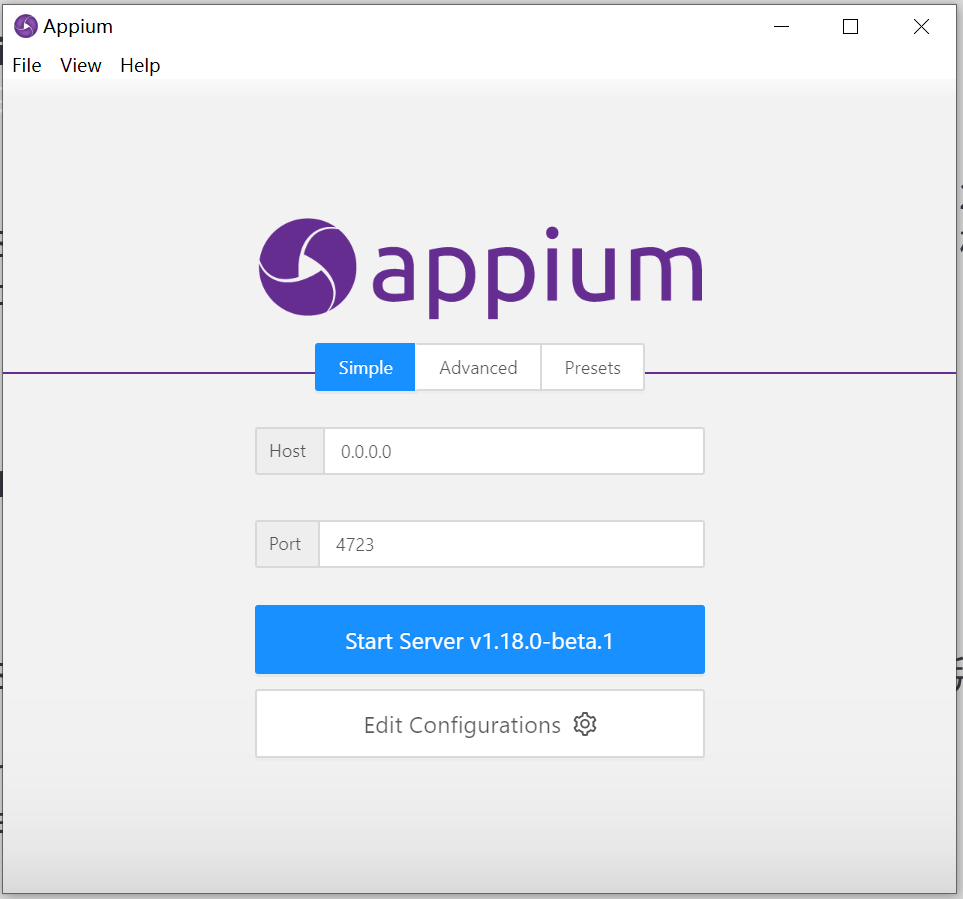
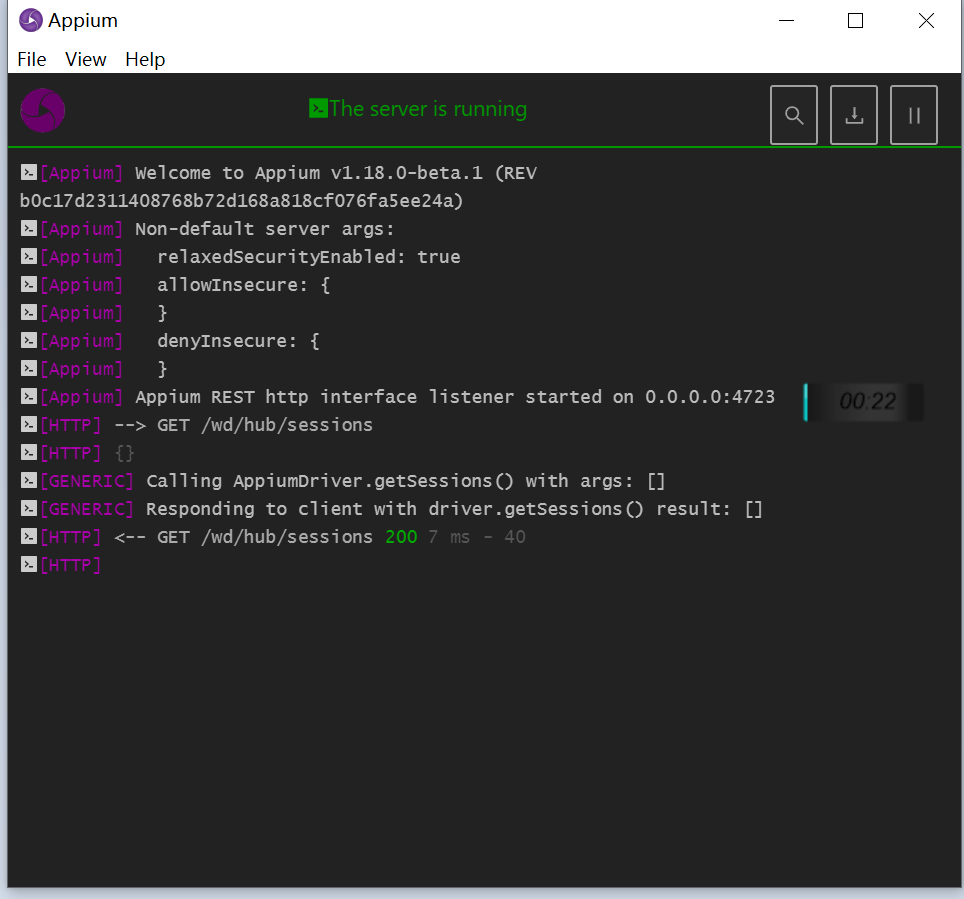
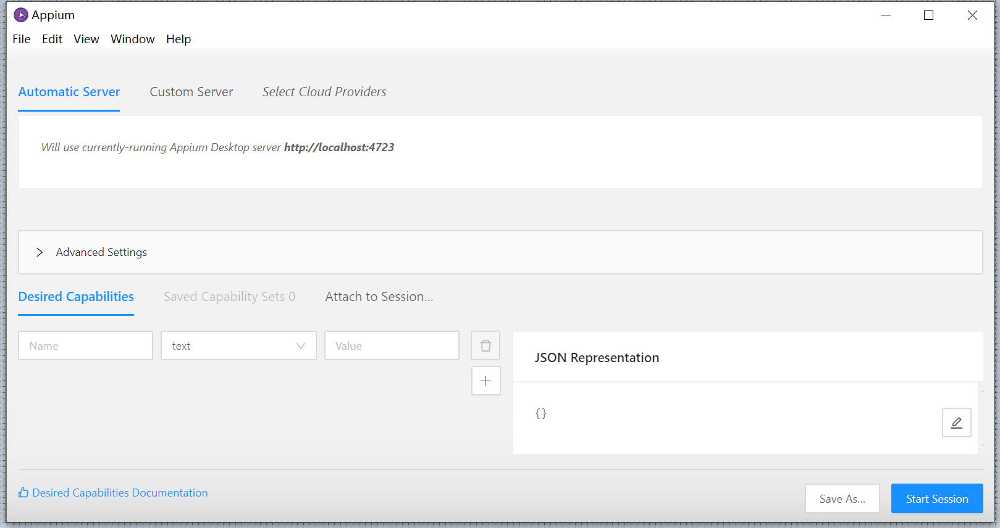
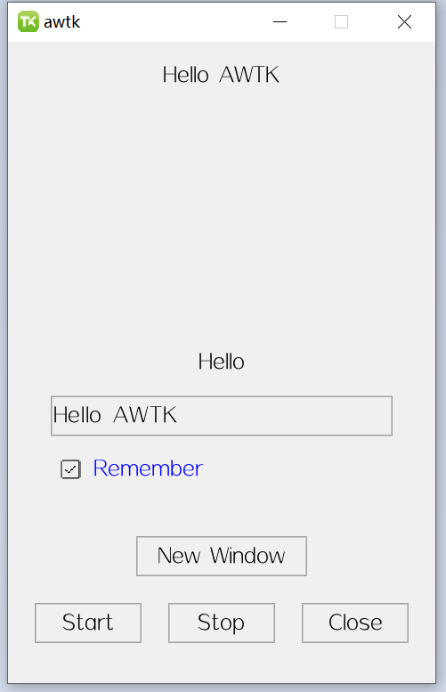
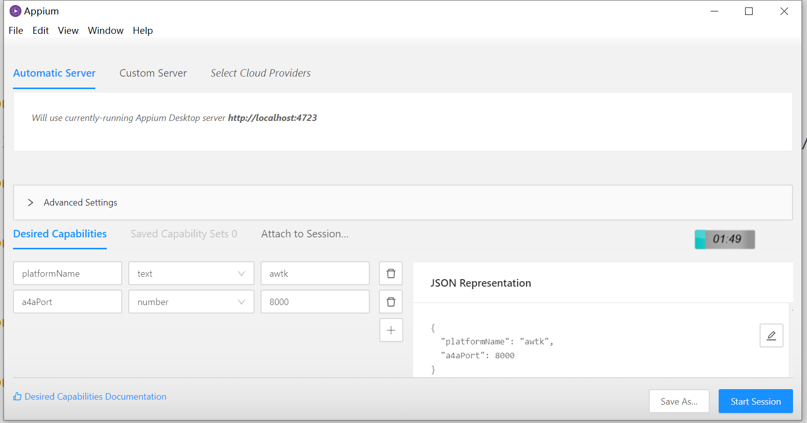

# 离线安装支持 AWTK 自动测试的 appium

> 本文是离线安装是针对 windows 平台的。

## 0. 安装 nodejs

appium 是用 nodejs 开发的，需要安装 [nodejs](https://nodejs.org/en/)，并设置好路径。

## 1. 安装 appium desktop

### 1.1 下载

Windows 版本可以下载这个：Appium-windows-1.18.0-1（awtk-appium）.zip

> 这个是内部 share 服务器中下载

### 1.2 解压

把 Appium-windows-1.18.0-1（awtk-appium）.zip 文件解压出来。

> 备注：如果是做回归测试（awtk-regression-test）的话，可以不用管下面的步骤。

## 2. 启动 Appium-desktop

运行 Appium.exe 命令：

```
./Appium.exe
```

* 启动成功后会看到下面的界面：



* 用缺省参数启动 appium 服务，启动成功后会看到下面的界面：



## 3. 启动 inspector

> 此步可选，不需要的童鞋请跳过。

* 点击上图的  按钮，可以启动 appium inspector，成功后可以看到下面的界面：



* 启动一个支持自动测试的 AWTK 应用程序，如 awtk-ui-automation 中的 demo

```
awtk-ui-automation
./bin/demo
```

界面效果如下：



* 回到 appium-inspector, 输入下面的参数

```json
{
  "platformName": "awtk",
  "a4aPort": 8000
}
```



* 然后点击"Start Session"，成功后可以看到下面的界面：


